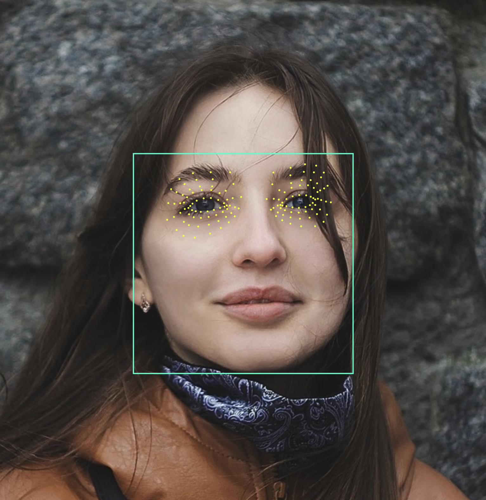
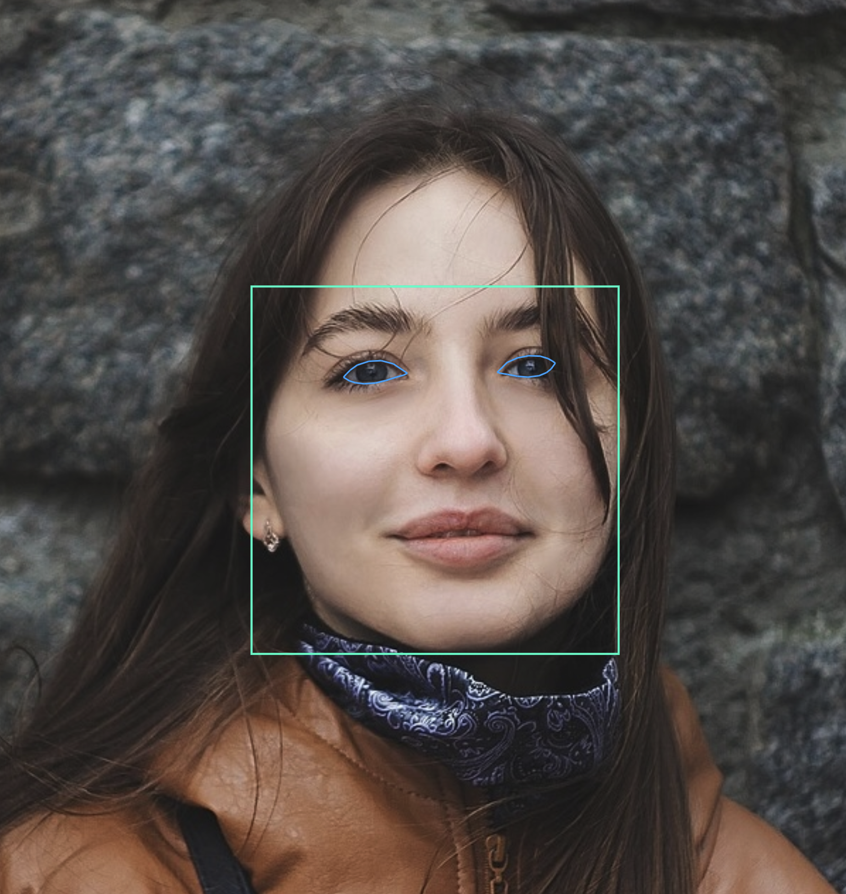

# face_detection_tflite

[](https://pub.dev/packages/face_detection_tflite/score)
[](https://pub.dev/packages/face_detection_tflite)

Flutter implementation of Google's MediaPipe face and facial landmark detection models using TensorFlow Lite.
Completely local: no remote API, just pure on-device, offline detection.

### Bounding Boxes


### Facial Mesh (468-Point)


### Facial Landmarks


### Eye Tracking

#### Iris Detection:


#### Eye Area Mesh (71-Point):

Note: The Facial mesh and eye area mesh are separate. 



#### Eye Contour:



## Features

- On-device face detection, runs fully offline
- **Face recognition**: 192-dim embeddings to identify/compare faces across images
- 468 point mesh with **3D depth information** (x, y, z coordinates)
- Face landmarks, comprehensive eye tracking (iris + 71-point eye mesh), and bounding boxes
- All coordinates are in absolute pixel coordinates
- Truly cross-platform: compatible with Android, iOS, macOS, Windows, and Linux
- Native OpenCV preprocessing (resize/letterbox/crops) for 2x+ throughput vs pure Dart
- The [example](https://pub.dev/packages/face_detection_tflite/example) app illustrates how to detect and render results on images
  - Includes demo for bounding boxes, the 468-point mesh, facial landmarks and comprehensive eye tracking.

## Quick Start

```dart
import 'dart:io';
import 'package:face_detection_tflite/face_detection_tflite.dart';

Future main() async {
  FaceDetector detector = FaceDetector();
  await detector.initialize(model: FaceDetectionModel.backCamera);

  final imageBytes = await File('path/to/image.jpg').readAsBytes();
  List<Face> faces = await detector.detectFaces(imageBytes);

  for (final face in faces) {
    final boundingBox = face.boundingBox;
    final landmarks   = face.landmarks;
    final mesh = face.mesh;
    final eyes = face.eyes;
  }

  detector.dispose();
}
```

## Performance

Version 4.1 moved image preprocessing to native OpenCV (via `opencv_dart`) for ~2x faster performance with SIMD acceleration. The standard `detectFaces()` method now uses OpenCV internally, so all existing code automatically gets the performance boost.

### Hardware Acceleration

The package automatically selects the best acceleration strategy for each platform:

| Platform | Default Delegate | Speedup | Notes |
|----------|-----------------|---------|-------|
| **macOS** | XNNPACK | 2-5x | SIMD vectorization (NEON on ARM, AVX on x86) |
| **Linux** | XNNPACK | 2-5x | SIMD vectorization |
| **iOS** | Metal GPU | 2-4x | Hardware GPU acceleration |
| **Android** | CPU | 1x | GPU delegate unreliable (see below) |
| **Windows** | CPU | 1x | XNNPACK crashes on Windows |

No configuration needed - just call `initialize()` and you get the optimal performance for your platform.

### Android Performance Note

The Android GPU delegate has known compatibility issues across different devices and Android versions:
- OpenCL unavailable on many devices (Pixel 6+, Android 12+)
- OpenGL ES 3.1+ required for fallback
- Some devices crash during GPU delegate initialization

For maximum compatibility, Android defaults to CPU-only execution. If you want to experiment with GPU acceleration on Android (at your own risk), see the [Advanced Configuration](#advanced-performance-configuration) section.

### Advanced Performance Configuration

```dart
// Auto mode (default) - optimal for each platform
await detector.initialize();
// Equivalent to:
await detector.initialize(performanceConfig: PerformanceConfig.auto());

// Force XNNPACK (desktop only - macOS/Linux)
await detector.initialize(
  performanceConfig: PerformanceConfig.xnnpack(numThreads: 4),
);

// Force GPU delegate (iOS recommended, Android experimental)
await detector.initialize(
  performanceConfig: PerformanceConfig.gpu(),
);

// CPU-only (maximum compatibility)
await detector.initialize(
  performanceConfig: PerformanceConfig.disabled,
);
```

### Advanced: Direct Mat Input

For live camera streams, you can bypass image encoding/decoding entirely by using `detectFacesFromMat()`:

```dart
import 'package:face_detection_tflite/face_detection_tflite.dart';

Future<void> processFrame(cv.Mat frame) async {
  final detector = FaceDetector();
  await detector.initialize(model: FaceDetectionModel.frontCamera);

  // Direct Mat input - fastest for video streams
  final faces = await detector.detectFacesFromMat(frame, mode: FaceDetectionMode.fast);

  frame.dispose(); // always dispose Mats after use
  detector.dispose();
}
```

**When to use `detectFacesFromMat()`:**
- Live camera streams where frames are already in memory
- When you need to preprocess images with OpenCV before detection
- Maximum throughput scenarios (avoids JPEG encode/decode overhead)

**For all other cases**, use the standard `detectFaces()` method with image bytes.

## Bounding Boxes

The boundingBox property returns a BoundingBox object representing the face bounding box in
absolute pixel coordinates. The BoundingBox provides convenient access to corner points,
dimensions (width and height), and the center point.

### Accessing Corners

```dart

final BoundingBox boundingBox = face.boundingBox;

// Access individual corners by name (each is a Point with x and y)
final Point topLeft     = boundingBox.topLeft;       // Top-left corner
final Point topRight    = boundingBox.topRight;      // Top-right corner
final Point bottomRight = boundingBox.bottomRight;   // Bottom-right corner
final Point bottomLeft  = boundingBox.bottomLeft;    // Bottom-left corner

// Access coordinates
print('Top-left: (${topLeft.x}, ${topLeft.y})');
```

### Additional Bounding Box Parameters

```dart

final BoundingBox boundingBox = face.boundingBox;

// Access dimensions and center
final double width  = boundingBox.width;     // Width in pixels
final double height = boundingBox.height;    // Height in pixels
final Point center = boundingBox.center;  // Center point

// Access coordinates
print('Size: ${width} x ${height}');
print('Center: (${center.x}, ${center.y})');

// Access all corners as a list (order: top-left, top-right, bottom-right, bottom-left)
final List<Point> allCorners = boundingBox.corners;
```

## Landmarks

The landmarks property returns a FaceLandmarks object with 6 key facial feature points
in absolute pixel coordinates. These landmarks provide quick access to common facial
features with convenient named properties.

### Accessing Landmarks

```dart
final FaceLandmarks landmarks = face.landmarks;

// Access individual landmarks using named properties
final leftEye  = landmarks.leftEye;
final rightEye = landmarks.rightEye;
final noseTip  = landmarks.noseTip;
final mouth    = landmarks.mouth;
final leftEyeTragion  = landmarks.leftEyeTragion;
final rightEyeTragion = landmarks.rightEyeTragion;

// Access coordinates
print('Left eye: (${leftEye?.x}, ${leftEye?.y})');
print('Nose tip: (${noseTip?.x}, ${noseTip?.y})');

// Iterate through all landmarks
for (final point in landmarks.values) {
  print('Landmark: (${point.x}, ${point.y})');
}
```

## Face Mesh

The `mesh` property returns a `FaceMesh` object containing 468 facial landmark points with both
2D and 3D coordinate access. These points map to specific facial features and can be used for
precise face tracking and rendering.

### Accessing Mesh Points

  ```dart
  import 'package:face_detection_tflite/face_detection_tflite.dart';

  final FaceMesh? mesh = face.mesh;

  if (mesh != null) {
    // Get mesh points
    final points = mesh.points;

    // Total number of points (always 468)
    print('Mesh points: ${points.length}');

    // Iterate through all points (all mesh points have z-coordinates)
    for (int i = 0; i < points.length; i++) {
      final point = points[i];
      print('Point $i: (${point.x}, ${point.y}, ${point.z})');
    }

    // Access individual points using index operator
    final noseTip = mesh[1];     // Nose tip point
    final leftEye = mesh[33];    // Left eye point
    final rightEye = mesh[263];  // Right eye point
  }
  ```

### Accessing Points with Optional Depth Information

The `FaceMesh` points have x and y coordinates, and an optional z coordinate representing
depth. 3D coordinates are always computed for mesh and iris landmarks.

  ```dart
  import 'package:face_detection_tflite/face_detection_tflite.dart';

  final FaceMesh? mesh = face.mesh;

  if (mesh != null) {
    // Get all points
    final points = mesh.points;

    // Iterate through all points
    for (final point in points) {
      if (point.is3D) {
        print('Point with depth: (${point.x}, ${point.y}, ${point.z})');
      } else {
        print('Point: (${point.x}, ${point.y})');
      }
    }

    // Access individual points directly using index operator
    final noseTip = mesh[1];
    if (noseTip.is3D) {
      print('Nose tip depth: ${noseTip.z}');
    }
  }
  ```

## Eye Tracking (Iris + Eye Mesh)

The `eyes` property returns comprehensive eye tracking data for both eyes in absolute pixel
coordinates. Each eye includes:
- **Iris center** (`irisCenter`): The iris center point
- **Iris contour** (`irisContour`): 4 points outlining the iris boundary
- **Contour** (`contour`): 15 points outlining the eyelid
- **Mesh** (`mesh`): 71 landmarks covering the entire eye region

Only available in FaceDetectionMode.full.

### Accessing Eye Data

```dart

final EyePair? eyes = face.eyes;

// Access left and right eye data (each is an Eye object containing all eye info)
final Eye? leftEye = eyes?.leftEye;
final Eye? rightEye = eyes?.rightEye;

if (leftEye != null) {
  // Access iris center
  final irisCenter = leftEye.irisCenter;
  print('Left iris center: (${irisCenter.x}, ${irisCenter.y})');

  // Access iris contour points (4 points outlining the iris)
  for (final point in leftEye.irisContour) {
    print('Iris contour: (${point.x}, ${point.y})');
  }

  // Access eye mesh landmarks (71 points covering the entire eye region)
  for (final point in leftEye.mesh) {
    print('Eye mesh point: (${point.x}, ${point.y})');
  }

  // Access just the eyelid contour (first 15 points of the eye mesh)
  for (final point in leftEye.contour) {
    print('Eyelid contour: (${point.x}, ${point.y})');
  }
}

// Right eye works the same way
if (rightEye != null) {
  final irisCenter = rightEye.irisCenter;
  print('Right iris center: (${irisCenter.x}, ${irisCenter.y})');
}
```

### Rendering Eye Contours

For rendering the visible eyelid outline, use the `contour` getter and connect them using `eyeLandmarkConnections`:

```dart
import 'package:face_detection_tflite/face_detection_tflite.dart';

// Get the visible eyeball contour (first 15 of 71 points)
final List<Point> eyelidOutline = leftEye.contour;

// Draw the eyelid outline by connecting the points
for (final connection in eyeLandmarkConnections) {
  final p1 = eyelidOutline[connection[0]];
  final p2 = eyelidOutline[connection[1]];
  canvas.drawLine(
    Offset(p1.x, p1.y),
    Offset(p2.x, p2.y),
    paint,
  );
}
```

## Face Detection Modes

This app supports three detection modes that determine which facial features are detected:

| Mode | Features | Est. Time per Face* |
|------|----------|---------------------|
| **Full** (default) | Bounding boxes, landmarks, 468-point mesh, eye tracking (iris + 71-point eye mesh) | ~80-120ms           |
| **Standard** | Bounding boxes, landmarks, 468-point mesh | ~60ms               |
| **Fast** | Bounding boxes, landmarks | ~30ms               |

*Est. times per faces are based on 640x480 resolution on modern hardware. Performance scales with image size and number of faces.

### Code Examples

The Face Detection Mode can be set using the `mode` parameter. Defaults to FaceDetectionMode.full.

```dart
// Full mode (default): bounding boxes, 6 basic landmarks + mesh + comprehensive eye tracking
// note: full mode provides superior accuracy for left and right eye landmarks
// compared to fast/standard modes. use full mode when precise eye tracking
// (iris center, iris contour, eyelid shape) is required. trade-off: longer inference
await faceDetector.detectFaces(bytes, mode: FaceDetectionMode.full);

// Standard mode: bounding boxes, 6 basic landmarks + mesh. inference time
// is faster than full mode, but slower than fast mode.
await faceDetector.detectFaces(bytes, mode: FaceDetectionMode.standard);

// Fast mode: bounding boxes + 6 basic landmarks only. fastest inference
// time of the three modes.
await faceDetector.detectFaces(bytes, mode: FaceDetectionMode.fast);
```

Try the [sample code](https://pub.dev/packages/face_detection_tflite/example) from the pub.dev example tab to easily compare
modes and inferences timing.

## Models

This package supports multiple detection models optimized for different use cases:

| Model | Best For | 
|-------|----------|
| **backCamera** (default) | Group shots, distant faces, rear camera | 
| **frontCamera** | Selfies, close-up portraits, front camera | 
| **shortRange** | Close-range faces (within ~2m) |
| **full** | Mid-range faces (within ~5m) |
| **fullSparse** | Mid-range faces with faster inference (~30% speedup) | 

### Code Examples

The model can be set using the `model` parameter when initialize is called. Defaults to FaceDetectionModel.backCamera.

```dart
FaceDetector faceDetector = FaceDetector();

// backCamera (default): larger model for group shots or images with smaller faces
await faceDetector.initialize(model: FaceDetectionModel.backCamera);

// frontCamera: optimized for selfies and close-up portraits
await faceDetector.initialize(model: FaceDetectionModel.frontCamera);

// shortRange: best for short-range images (faces within ~2m)
await faceDetector.initialize(model: FaceDetectionModel.shortRange);

// full: best for mid-range images (faces within ~5m)
await faceDetector.initialize(model: FaceDetectionModel.full);

// fullSparse: same detection quality as full but runs up to 30% faster on CPU
// (slightly higher precision, slightly lower recall)
await faceDetector.initialize(model: FaceDetectionModel.fullSparse);
```

## Live Camera Detection


For real-time face detection with a camera feed, use `detectFacesFromMat()` to avoid repeated JPEG encode/decode overhead. This provides the best performance for video streams.

```dart
import 'package:camera/camera.dart';
import 'package:face_detection_tflite/face_detection_tflite.dart';

FaceDetector detector = FaceDetector();
await detector.initialize(model: FaceDetectionModel.frontCamera);

final cameras = await availableCameras();
CameraController camera = CameraController(cameras.first, ResolutionPreset.medium);
await camera.initialize();

camera.startImageStream((CameraImage image) async {
  // Convert CameraImage (YUV420) directly to cv.Mat (BGR)
  final cv.Mat mat = convertCameraImageToMat(image); // see example app

  // Detect faces using Mat for maximum performance
  List<Face> faces = await detector.detectFacesFromMat(
    mat,
    mode: FaceDetectionMode.fast,
  );

  // Always dispose Mat after use
  mat.dispose();

  // Process faces...
});
```

**Key differences from image detection:**
- Use `detectFacesFromMat()` instead of `detectFaces()` to bypass JPEG encoding/decoding
- Convert YUV420 camera frames directly to BGR Mat format
- Always call `mat.dispose()` after detection
- Use `FaceDetectionMode.fast` for real-time performance

See the full [example app](https://pub.dev/packages/face_detection_tflite/example) for complete implementation including YUV-to-Mat conversion and frame throttling.

## Background Isolate Detection

For applications that require guaranteed non-blocking UI, use `FaceDetectorIsolate`. This runs the **entire** detection pipeline in a background isolate, ensuring all processing happens off the main thread.

```dart
import 'package:face_detection_tflite/face_detection_tflite.dart';

// Spawn isolate (loads models in background)
final detector = await FaceDetectorIsolate.spawn();

// All detection runs in background isolate - UI never blocked
final faces = await detector.detectFaces(imageBytes);

for (final face in faces) {
  print('Face at: ${face.boundingBox.center}');
  print('Mesh points: ${face.mesh?.length ?? 0}');
}

// Cleanup when done
await detector.dispose();
```

### When to Use FaceDetectorIsolate

| Use Case | Recommended |
|----------|-------------|
| Live camera with 60fps UI requirement | `FaceDetectorIsolate` |
| Processing images in a batch queue | `FaceDetectorIsolate` |
| Simple single-image detection | `FaceDetector` |
| Maximum control over pipeline stages | `FaceDetector` |

### Configuration

`FaceDetectorIsolate.spawn()` accepts the same configuration options as `FaceDetector.initialize()`, except for `InterpreterOptions`:

```dart
final detector = await FaceDetectorIsolate.spawn(
  model: FaceDetectionModel.frontCamera,
  performanceConfig: PerformanceConfig.auto(), // Or .gpu() for iOS
  meshPoolSize: 2,
);
```

### OpenCV Mat Support

`FaceDetectorIsolate` fully supports OpenCV `cv.Mat` input, ideal for live camera processing:

```dart
import 'package:opencv_dart/opencv_dart.dart' as cv;

// From cv.Mat (e.g., decoded image or camera frame)
final mat = cv.imdecode(imageBytes, cv.IMREAD_COLOR);
final faces = await detector.detectFacesFromMat(mat);
mat.dispose();

// From raw BGR bytes (e.g., converted camera YUV)
final faces = await detector.detectFacesFromMatBytes(
  bgrBytes,
  width: frameWidth,
  height: frameHeight,
);
```

The Mat is reconstructed in the background isolate using zero-copy transfer, so there's no encoding/decoding overhead.

## Face Recognition (Embeddings) 

Generate 192-dimensional identity vectors to compare faces across images. Useful for identifying the same person in different photos.

```dart
final detector = FaceDetector();
await detector.initialize();

// Get reference embedding from a photo with one face
final refFaces = await detector.detectFaces(photo1Bytes, mode: FaceDetectionMode.fast);
final refEmbedding = await detector.getFaceEmbedding(refFaces.first, photo1Bytes);

// Compare against faces in another photo
final faces = await detector.detectFaces(photo2Bytes, mode: FaceDetectionMode.fast);
for (final face in faces) {
  final embedding = await detector.getFaceEmbedding(face, photo2Bytes);
  final similarity = FaceDetector.compareFaces(refEmbedding, embedding);
  print('Similarity: ${similarity.toStringAsFixed(2)}'); // -1.0 to 1.0
}

detector.dispose();
```

**Similarity thresholds:**
- `> 0.6` — Very likely same person
- `> 0.5` — Probably same person
- `< 0.3` — Different people

Also available: `FaceDetector.faceDistance()` for Euclidean distance, and batch processing with `getFaceEmbeddings()`.

### Memory Considerations

The background isolate holds all TFLite models (~26-40MB for full pipeline). Always call `dispose()` when finished to release these resources. Image data is transferred using zero-copy `TransferableTypedData`, minimizing memory overhead.

## Example

The [sample code](https://pub.dev/packages/face_detection_tflite/example) from the pub.dev example tab includes a
Flutter app that paints detections onto an image: bounding boxes, landmarks, mesh, and comprehensive eye tracking. The
example code provides inference time, and demonstrates when to use `FaceDetectionMode.standard` or `FaceDetectionMode.fast`.

## Inspiration

At the time of development, there was no open-source solution for cross-platform, on-device face and landmark detection.
This package took inspiration and was ported from the original Python project **[patlevin/face-detection-tflite](https://github.com/patlevin/face-detection-tflite)**. Many thanks to the original author.
