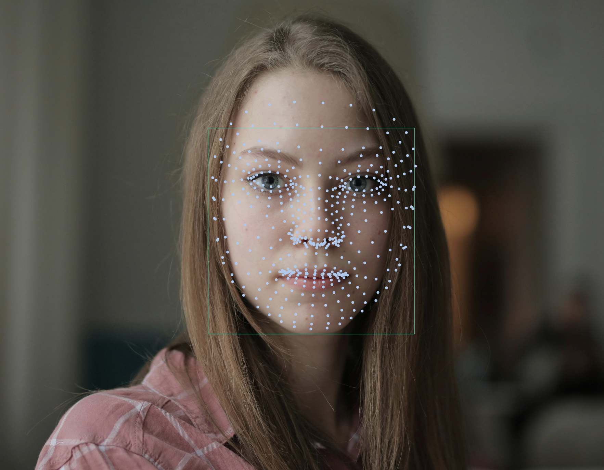
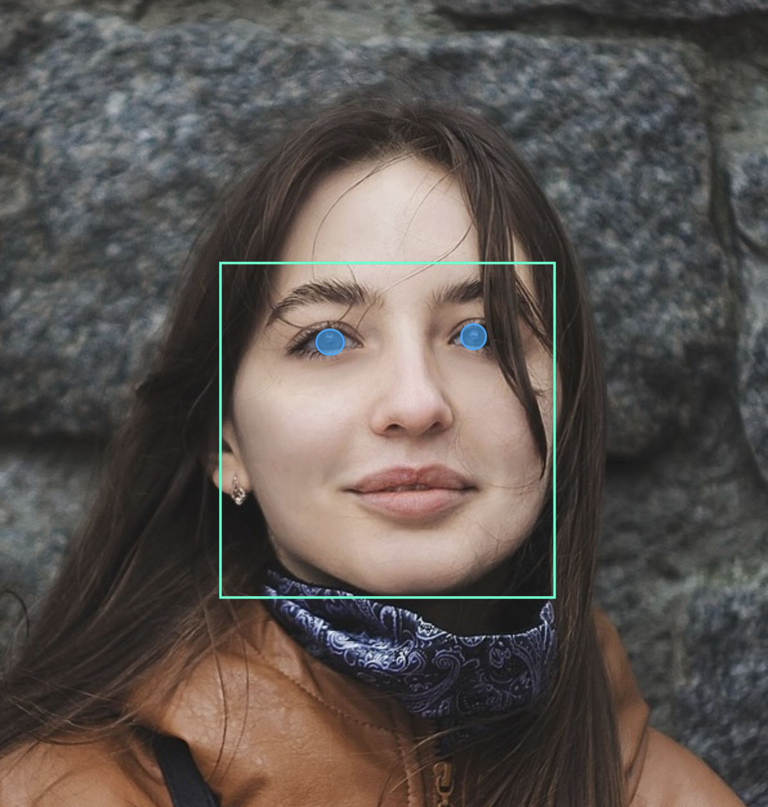

# face_detection_tflite

A pure Dart/Flutter implementation of Google's MediaPipe face detection and facial landmark models using TensorFlow Lite. 
This package provides on-device face and landmark detection with minimal dependencies, just TensorFlow Lite and image.

#### Bounding Box Example:


#### Mesh (468-Point) Example:



#### Landmark Example:


#### Iris Example:



## Features

- On-device face detection, runs fully offline
- 468 point mesh, face landmarks, iris landmarks and bounding boxes
- All coordinates are in absolute pixel coordinates
- Truly cross-platform: compatible with Android, iOS, macOS, Windows, and Linux
- The [example](https://pub.dev/packages/face_detection_tflite/example) app illustrates how to detect and render results on images 
  - Includes demo for bounding boxes, the 468-point mesh, facial landmarks and iris landmarks.

## Quick Start

```dart
import 'dart:io';
import 'package:face_detection_tflite/face_detection_tflite.dart';

Future main() async {
  // Initialize & set model
  FaceDetector detector = FaceDetector();
  await detector.initialize(model: FaceDetectionModel.backCamera);

  // Detect faces
  final imageBytes = await File('path/to/image.jpg').readAsBytes();
  List<Face> faces = await detector.detectFaces(imageBytes);

  // Access results
  for (Face face in faces) {
    final landmarks = face.landmarks;
    final bbox = face.bboxCorners;
    final mesh = face.mesh;
    final irises = face.irises;

    // FaceLandmarkType can be any of these: 
    // leftEye, rightEye, noseTip, mouth, leftEyeTragion, or rightEyeTragion
    final leftEye = landmarks[FaceLandmarkType.leftEye];
    print('Left eye: (${leftEye?.x}, ${leftEye?.y})');
  }

  // Don't forget to clean-up when you're done!
  detector.dispose();
}
```

## Bounding Boxes

The bboxCorners property returns the four corner points of the face bounding box in
absolute pixel coordinates. The corners are ordered as: top-left, top-right,
bottom-right, bottom-left.

### Accessing Corners

```dart
final bbox = face.bboxCorners;

// Individual corners (each is a Point<double> with x and y)
final topLeft = bbox[0];      // Top-left corner
final topRight = bbox[1];     // Top-right corner  
final bottomRight = bbox[2];  // Bottom-right corner
final bottomLeft = bbox[3];   // Bottom-left corner

// Access coordinates
print('Top-left: (${topLeft.x}, ${topLeft.y})');
```

## Landmarks

The landmarks property returns a map of 6 key facial feature points in absolute pixel
coordinates. These landmarks provide quick access to common facial features without needing
to reference specific mesh indices.

### Accessing Landmarks

```dart
final landmarks = face.landmarks;

// Access individual landmarks (each is a Point<double> with x and y)
final leftEye = landmarks[FaceLandmarkType.leftEye];
final rightEye = landmarks[FaceLandmarkType.rightEye];
final noseTip = landmarks[FaceLandmarkType.noseTip];
final mouth = landmarks[FaceLandmarkType.mouth];
final leftEyeTragion = landmarks[FaceLandmarkType.leftEyeTragion];
final rightEyeTragion = landmarks[FaceLandmarkType.rightEyeTragion];

// Access coordinates
print('Left eye: (${leftEye?.x}, ${leftEye?.y})');
print('Nose tip: (${noseTip?.x}, ${noseTip?.y})');

// Iterate through all landmarks
landmarks.forEach((type, point) {
  print('$type: (${point.x}, ${point.y})');
});
```

## Face Mesh

The mesh property returns a list of 468 facial landmark points that form a detailed 3D
face mesh in absolute pixel coordinates. These points map to specific facial features
and can be used for precise face tracking and rendering.

### Accessing Points

  ```dart
  final mesh = face.mesh;

  // Total number of points (always 468)
  print('Mesh points: ${mesh.length}');

  // Iterate through all points
  for (int i = 0; i < mesh.length; i++) {
    final point = mesh[i];
    print('Point $i: (${point.x}, ${point.y})');
  }

  // Access individual points (each is a Point<double> with x and y)
  final noseTip = mesh[1];     // Nose tip point
  final leftEye = mesh[33];    // Left eye point
  final rightEye = mesh[263];  // Right eye point
  ```

## Irises

The irises property returns detailed iris tracking data for both eyes in absolute pixel
coordinates. Each iris includes the center point and 5 contour points that outline the
iris boundary. Only available in FaceDetectionMode.full.

### Accessing Iris Data

```dart
final irises = face.irises;

// Access left and right iris (each is an Iris object)
final leftIris = irises?.leftIris;
final rightIris = irises?.rightIris;

// Access iris center
final leftCenter = leftIris?.center;
print('Left iris center: (${leftCenter?.x}, ${leftCenter?.y})');

// Access iris contour points (4 points outlining the iris)
final leftContour = leftIris?.contour;
for (int i = 0; i < (leftContour?.length ?? 0); i++) {
  final point = leftContour![i];
  print('Left iris contour $i: (${point.x}, ${point.y})');
}

// Right iris
final rightCenter = rightIris?.center;
final rightContour = rightIris?.contour;
print('Right iris center: (${rightCenter?.x}, ${rightCenter?.y})');
```

## Face Detection Modes

This app supports three detection modes that determine which facial features are detected:

| Mode | Features | Est. Time per Face* |
|------|----------|---------------------|
| **Full** (default) | Bounding boxes, landmarks, 468-point mesh, iris tracking | ~80-120ms           |
| **Standard** | Bounding boxes, landmarks, 468-point mesh | ~60ms               |
| **Fast** | Bounding boxes, landmarks | ~30ms               |

*Est. times per faces are based on 640x480 resolution on modern hardware. Performance scales with image size and number of faces.

### Code Examples

The Face Detection Mode can be set using the `mode` parameter when detectFaces is called. Defaults to FaceDetectionMode.full.

```dart
// Full mode (default): bounding boxes, 6 basic landmarks + mesh + iris
// note: full mode provides superior accuracy for left and right eye landmarks
// compared to fast/standard modes. use full mode when precise eye landmark
// detection is required for your application. trade-off: longer inference
await faceDetector.detectFaces(bytes, mode: FaceDetectionMode.full);

// Standard mode: bounding boxes, 6 basic landmarks + mesh. inference time 
// is faster than full mode, but slower than fast mode.
await faceDetector.detectFaces(bytes, mode: FaceDetectionMode.standard);

// Fast mode: bounding boxes + 6 basic landmarks only. fastest inference
// time of the three modes.
await faceDetector.detectFaces(bytes, mode: FaceDetectionMode.fast);
```

Try the [sample code](https://pub.dev/packages/face_detection_tflite/example) from the pub.dev example tab to easily compare
modes and inferences timing.

## Models

This package supports multiple detection models optimized for different use cases:

| Model | Best For | 
|-------|----------|
| **backCamera** (default) | Group shots, distant faces, rear camera | 
| **frontCamera** | Selfies, close-up portraits, front camera | 
| **shortRange** | Close-range faces (within ~2m) |
| **full** | Mid-range faces (within ~5m) |
| **fullSparse** | Mid-range faces with faster inference (~30% speedup) | 

### Code Examples

The model can be set using the `model` parameter when initialize is called. Defaults to FaceDetectionModel.backCamera.

```dart
FaceDetector faceDetector = FaceDetector();

// backCamera (default): larger model for group shots or images with smaller faces
await faceDetector.initialize(model: FaceDetectionModel.backCamera);

// frontCamera: optimized for selfies and close-up portraits
await faceDetector.initialize(model: FaceDetectionModel.frontCamera);

// shortRange: best for short-range images (faces within ~2m)
await faceDetector.initialize(model: FaceDetectionModel.shortRange);

// full: best for mid-range images (faces within ~5m)
await faceDetector.initialize(model: FaceDetectionModel.full);

// fullSparse: same detection quality as full but runs up to 30% faster on CPU
// (slightly higher precision, slightly lower recall)
await faceDetector.initialize(model: FaceDetectionModel.fullSparse);
```

## Example

The [sample code](https://pub.dev/packages/face_detection_tflite/example) from the pub.dev example tab includes a 
Flutter app that paints detections onto an image: bounding boxes, landmarks, mesh, and iris. The 
example code provides inference time, and demonstrates when to use `FaceDetectionMode.standard` or `FaceDetectionMode.fast`.  

## Inspiration

At the time of development, there was no open-source solution for cross-platform, on-device face and landmark detection.
This package took inspiration and was ported from the original Python project **[patlevin/face-detection-tflite](https://github.com/patlevin/face-detection-tflite)**. Many thanks to the original author.
