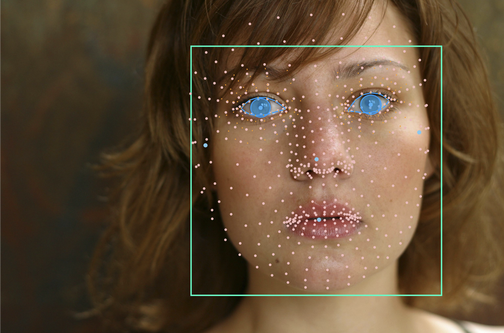
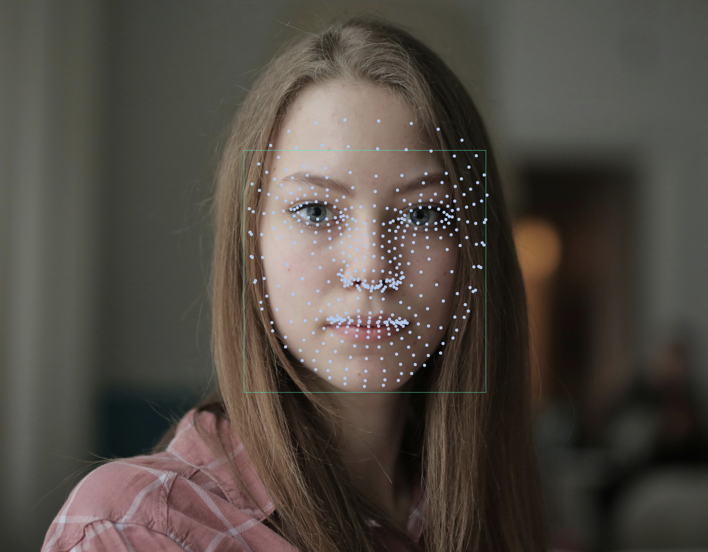
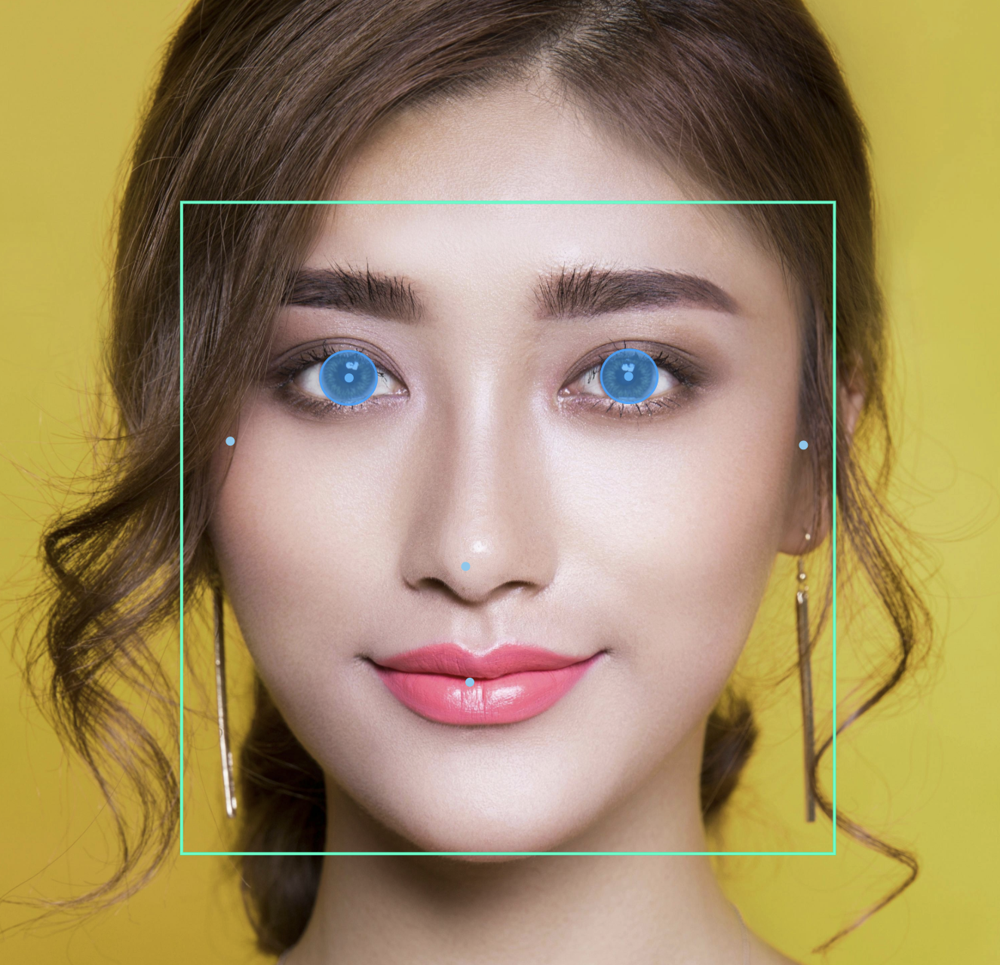
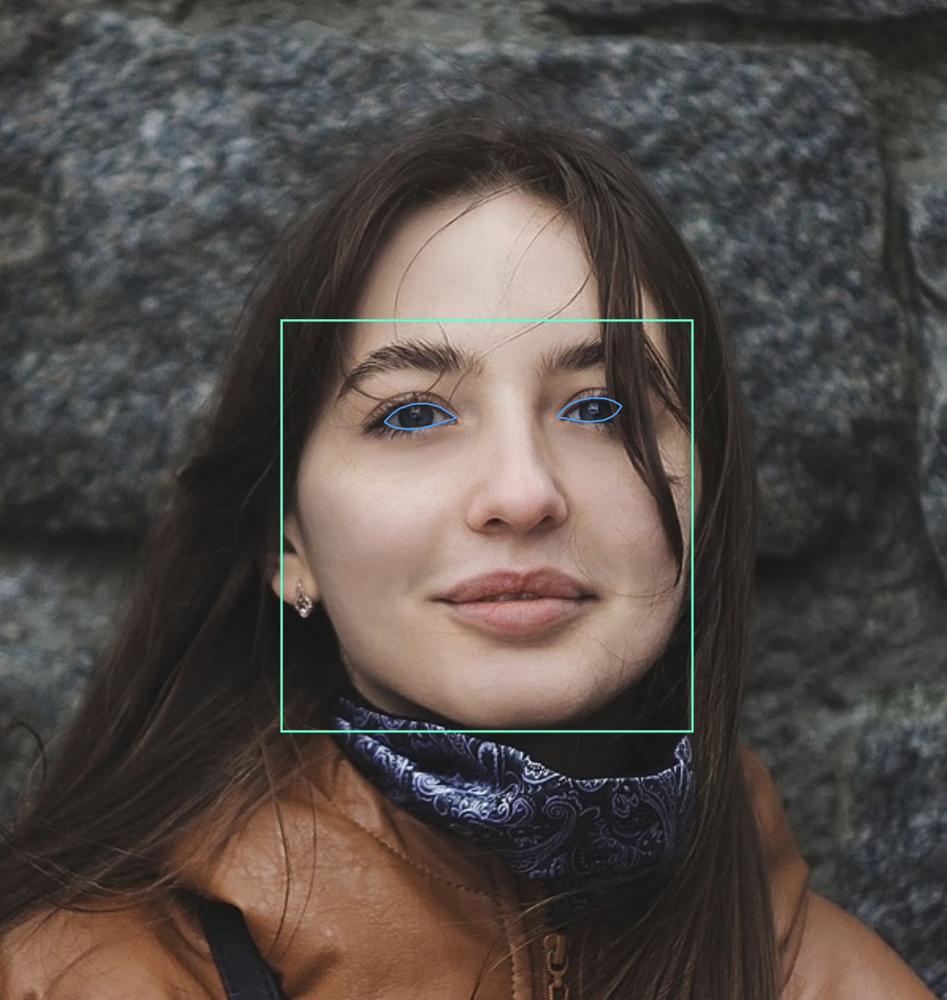
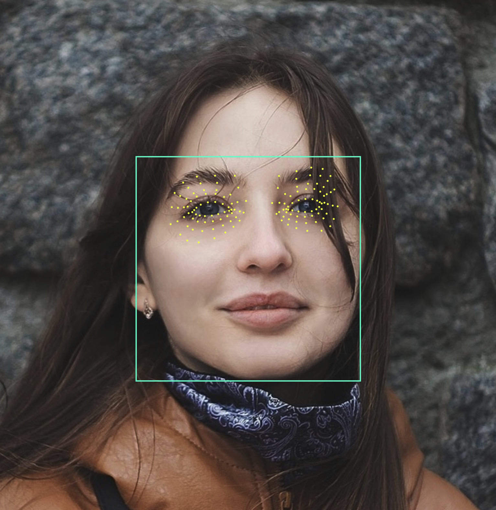
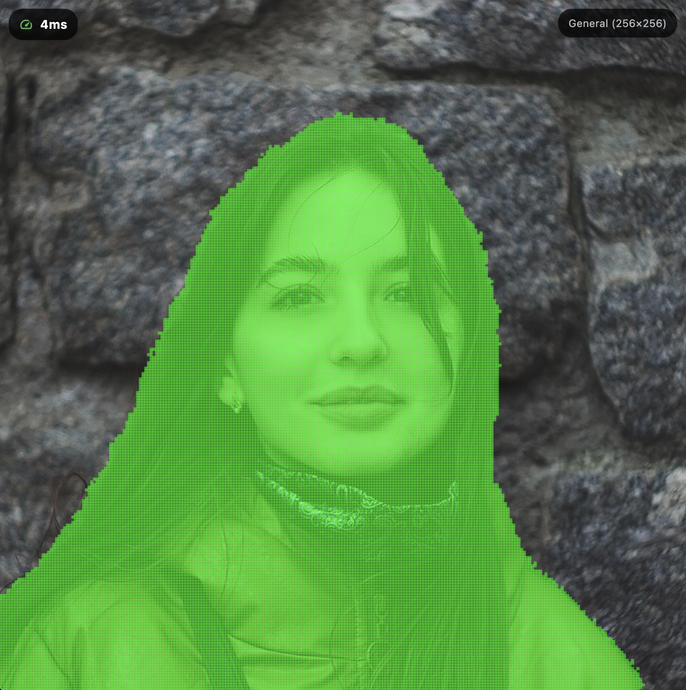

<h1 align="center">face_detection_tflite</h1>

<p align="center">
<a href="https://flutter.dev"></a>
<a href="https://dart.dev"></a>
<br>
<a href="https://pub.dev/packages/face_detection_tflite"></a>
<a href="https://pub.dev/packages/face_detection_tflite/score"></a>
<a href="https://github.com/hugocornellier/face_detection_tflite/actions/workflows/build.yml"></a>
<a href="https://github.com/hugocornellier/face_detection_tflite/actions/workflows/integration.yml"></a>
<a href="https://github.com/hugocornellier/face_detection_tflite/blob/main/LICENSE"></a>
</p>

Flutter implementation of Google's MediaPipe face and facial landmark detection models using LiteRT (formerly TensorFlow Lite).
Runs 100% offline/on-device. Highly performant: full detection runs in ~35ms per face, with a fast mode around 27ms. All work on a background isolate so the UI thread is never blocked.

> **~5.5x faster than Google ML Kit** on equivalent face detection tasks ([benchmark source](example/integration_test/mlkit_benchmark_test.dart))<sup>[†](#mlkit-comparison-benchmark)</sup>

| Face Mesh, Iris Detection, Eye Tracking | Multi-Face Detection |
|---|---|
|  |  |

## Features

- On-device face detection, runs fully offline
- Face landmarks, bounding boxes & eye tracking (iris + 71-point eye mesh)
- 468 point mesh with 3D depth information (x, y, z coordinates)
- Selfie segmentation: separate person from background, or use multiclass model for 6-class body part segmentation (hair, face, body, clothes, etc.)
- Face recognition (embeddings): identify/compare faces across images
- Truly cross-platform: compatible with Android, iOS, macOS, Windows, Linux and Web
- Full [example](https://pub.dev/packages/face_detection_tflite/example) app (for native platforms) that illustrates how to detect and render results on images
  - Includes demo for bounding boxes, facial mesh, landmarks and eye/iris tracking.
- The <a href="https://github.com/hugocornellier/face_detection_tflite/blob/main/example_web/lib/main.dart" target="_blank">web example</a> provides a complete web demo

## Quick Start

```dart
import 'package:face_detection_tflite/face_detection_tflite.dart';

Future main() async {
  // Initialize detector, run inference on image
  FaceDetector fd = await FaceDetector.create();
  List<Face> faces = await fd.detectFacesFromFilepath('path/to/image.jpg');

  // Iterate through detected faces
  for (final face in faces) {
    final boundingBox = face.boundingBox;
    final landmarks = face.landmarks;
    final mesh = face.mesh;
    final eyes = face.eyes;
  }

  await fd.dispose();
}
```

Already have bytes (from the network etc.)? Use `detectFacesFromBytes(imageBytes)`. For live camera streams, use `detectFacesFromCameraImage(...)` (keeps all OpenCV work off the UI thread, see below). For a pre-decoded `cv.Mat`, use `detectFacesFromMat(mat)`.

### Detection entry points

Pick the method that matches the input you already have. Each returns `Future<List<Face>>`:

| Input you have | Method | Input type | Example |
|----------------|--------|------------|---------|
| Image file on disk | `detectFacesFromFilepath` | `String` | shown above |
| Encoded image bytes (e.g. from the network) | `detectFacesFromBytes` | `Uint8List` (encoded JPEG/PNG) | [Encoded Image Bytes Example](#encoded-image-bytes-example) |
| Decoded OpenCV matrix | `detectFacesFromMat` | `cv.Mat` | [Direct Mat Example](#direct-mat-example) |
| Raw pixel bytes (+ width/height) | `detectFacesFromMatBytes` | `Uint8List` (raw BGR pixels) | [Raw Pixel Bytes Example](#raw-pixel-bytes-example) |
| Live camera frame | `detectFacesFromCameraImage` | `CameraImage` | [Live Camera Detection](#live-camera-detection) |

> `detectFacesFromBytes` decodes a compressed image file; `detectFacesFromMatBytes` takes already-decoded pixels and so requires `width`/`height`. Same `Uint8List` type, different content.

## Models

All TFLite models are sourced from Google's [MediaPipe](https://mediapipe.dev/) framework. The one exception is `mobilefacenet.tflite`, which is based on [MobileFaceNets](https://arxiv.org/abs/1804.07573). Where available, official model cards are archived in [`doc/model_cards/`](doc/model_cards/):

| Model | File | Model Card |
|-------|------|------------|
| Face Detection (front camera / short range) | `face_detection_front.tflite`, `face_detection_short_range.tflite` | [blazeface_short_range_model_card.pdf](doc/model_cards/blazeface_short_range_model_card.pdf) · [mediapipe.page.link/blazeface-mc](https://mediapipe.page.link/blazeface-mc) |
| Face Detection (back camera / full range) | `face_detection_back.tflite`, `face_detection_full_range.tflite` | [blazeface_full_range_model_card.pdf](doc/model_cards/blazeface_full_range_model_card.pdf) · [mediapipe.page.link/blazeface-back-mc](https://mediapipe.page.link/blazeface-back-mc) |
| Face Detection (full range sparse) | `face_detection_full_range_sparse.tflite` | [blazeface_full_range_sparse_model_card.pdf](doc/model_cards/blazeface_full_range_sparse_model_card.pdf) · [mediapipe.page.link/blazeface-back-sparse-mc](https://mediapipe.page.link/blazeface-back-sparse-mc) |
| Face Mesh (468-point landmark) | `face_landmark.tflite` | [face_landmark_model_card.pdf](doc/model_cards/face_landmark_model_card.pdf) · [mediapipe.page.link/facemesh-mc](https://mediapipe.page.link/facemesh-mc) |
| Iris Landmark (76-point) | `iris_landmark.tflite` | [iris_landmark_model_card.pdf](doc/model_cards/iris_landmark_model_card.pdf) · [mediapipe.page.link/iris-mc](https://mediapipe.page.link/iris-mc) |
| Selfie Segmentation | `selfie_segmenter.tflite`, `selfie_segmenter_landscape.tflite` | [selfie_segmentation_model_card.pdf](doc/model_cards/selfie_segmentation_model_card.pdf) · [mediapipe.page.link/selfiesegmentation-mc](https://mediapipe.page.link/selfiesegmentation-mc) |
| Multiclass Segmentation | `selfie_multiclass.tflite` | [multiclass_segmentation_model_card.pdf](doc/model_cards/multiclass_segmentation_model_card.pdf) |
| Face Embedding (192-dim) | `mobilefacenet.tflite` | [mobilefacenet_paper.pdf](doc/model_cards/mobilefacenet_paper.pdf) · [arXiv 1804.07573](https://arxiv.org/abs/1804.07573) |

## Bounding Boxes


The boundingBox property returns a BoundingBox object representing the face bounding box in
absolute pixel coordinates. The BoundingBox provides convenient access to corner points,
dimensions (width and height), and the center point.

### Accessing Corners

```dart
final BoundingBox boundingBox = face.boundingBox;

// Access individual corners by name (each is a Point with x and y)
final Point topLeft     = boundingBox.topLeft;       // Top-left corner
final Point topRight    = boundingBox.topRight;      // Top-right corner
final Point bottomRight = boundingBox.bottomRight;   // Bottom-right corner
final Point bottomLeft  = boundingBox.bottomLeft;    // Bottom-left corner

// Access coordinates
print('Top-left: (${topLeft.x}, ${topLeft.y})');
```

### Additional Bounding Box Parameters

```dart
final BoundingBox boundingBox = face.boundingBox;

// Access dimensions and center
final double width  = boundingBox.width;     // Width in pixels
final double height = boundingBox.height;    // Height in pixels
final Point center = boundingBox.center;  // Center point

// Access coordinates
print('Size: ${width} x ${height}');
print('Center: (${center.x}, ${center.y})');

// Access all corners as a list (order: top-left, top-right, bottom-right, bottom-left)
final List<Point> allCorners = boundingBox.corners;
```

## Landmarks


The landmarks property returns a FaceLandmarks object with 6 key facial feature points
in absolute pixel coordinates. These landmarks provide quick access to common facial
features with convenient named properties.

### Accessing Landmarks

```dart
final FaceLandmarks landmarks = face.landmarks;

// Access individual landmarks using named properties
final leftEye  = landmarks.leftEye;
final rightEye = landmarks.rightEye;
final noseTip  = landmarks.noseTip;
final mouth    = landmarks.mouth;
final leftEyeTragion  = landmarks.leftEyeTragion;
final rightEyeTragion = landmarks.rightEyeTragion;

// Access coordinates
print('Left eye: (${leftEye?.x}, ${leftEye?.y})');
print('Nose tip: (${noseTip?.x}, ${noseTip?.y})');

// Iterate through all landmarks
for (final point in landmarks.values) {
  print('Landmark: (${point.x}, ${point.y})');
}
```

## Face Mesh



The `mesh` property returns a `FaceMesh` object containing 468 facial landmark points with both
2D and 3D coordinate access. These points map to specific facial features and can be used for
precise face tracking and rendering.

### Accessing Mesh Points

  ```dart
  import 'package:face_detection_tflite/face_detection_tflite.dart';

  final FaceMesh? mesh = face.mesh;

  if (mesh != null) {
    // Get mesh points
    final points = mesh.points;

    // Total number of points (always 468)
    print('Mesh points: ${points.length}');

    // Iterate through all points (all mesh points have z-coordinates)
    for (int i = 0; i < points.length; i++) {
      final point = points[i];
      print('Point $i: (${point.x}, ${point.y}, ${point.z})');
    }

    // Access individual points using index operator
    final noseTip = mesh[1];     // Nose tip point
    final leftEye = mesh[33];    // Left eye point
    final rightEye = mesh[263];  // Right eye point
  }
  ```

### Accessing 3D Depth Information

All face mesh points include x, y, and z coordinates. The z coordinate represents
relative depth (scale-dependent). 3D coordinates are always computed for mesh and iris landmarks.

  ```dart
  import 'package:face_detection_tflite/face_detection_tflite.dart';

  final FaceMesh? mesh = face.mesh;

  if (mesh != null) {
    // Get all points
    final points = mesh.points;

    // Iterate through all points (all mesh points have x, y, and z)
    for (final point in points) {
      print('Point: (${point.x}, ${point.y}, ${point.z})');
    }

    // Access individual points directly using index operator
    final noseTip = mesh[1];
    print('Nose tip depth: ${noseTip.z}');
  }
  ```

## Eye Tracking (Iris + Eye Mesh)

The `eyes` property returns comprehensive eye tracking data for both eyes in absolute pixel
coordinates. Only available in FaceDetectionMode.full.

### Iris Detection



Each eye includes an iris center point and 4 contour points outlining the iris boundary.

```dart
final EyePair? eyes = face.eyes;
final Eye? leftEye = eyes?.leftEye;

if (leftEye != null) {
  final irisCenter = leftEye.irisCenter;
  print('Iris center: (${irisCenter.x}, ${irisCenter.y})');

  for (final point in leftEye.irisContour) {
    print('Iris contour: (${point.x}, ${point.y})');
  }
}
```

### Eye Contour



The eyelid contour consists of 15 points outlining the visible eyelid. Connect them using `eyeLandmarkConnections`:

```dart
final List<Point> eyelidOutline = leftEye.contour;

for (final connection in eyeLandmarkConnections) {
  final p1 = eyelidOutline[connection[0]];
  final p2 = eyelidOutline[connection[1]];
  canvas.drawLine(
    Offset(p1.x, p1.y),
    Offset(p2.x, p2.y),
    paint,
  );
}
```

### Eye Area Mesh (71-Point)



71 landmarks covering the entire eye region. Note: The facial mesh and eye area mesh are separate.

```dart
final Eye? leftEye = face.eyes?.leftEye;

if (leftEye != null) {
  for (final point in leftEye.mesh) {
    print('Eye mesh point: (${point.x}, ${point.y})');
  }
}
```

## Face Detection Modes

This package supports three detection modes that determine which facial features are detected:

| Mode | Features | Est. Time per Face* |
|------|----------|---------------------|
| **Full** (default) | Bounding boxes, landmarks, 468-point mesh, eye tracking (iris + 71-point eye mesh) | ~35ms               |
| **Standard** | Bounding boxes, landmarks, 468-point mesh | ~31ms               |
| **Fast** | Bounding boxes, landmarks | ~27ms               |

*Est. times per face are based on 640x480 resolution on modern hardware. Performance scales with image size and number of faces.

### Code Examples

The Face Detection Mode can be set using the `mode` parameter. Defaults to FaceDetectionMode.full.

```dart
// Full mode (default): bounding boxes, 6 basic landmarks + mesh + comprehensive eye tracking
// note: in full mode, landmarks.leftEye and landmarks.rightEye are replaced with
// iris-refined coordinates, providing significantly more accurate eye positions
// compared to the raw detection keypoints used in fast/standard modes.
// use full mode when precise eye tracking (iris center, contour, eyelid shape) is required.
await fd.detectFacesFromBytes(bytes, mode: FaceDetectionMode.full);

// Standard mode: bounding boxes, 6 basic landmarks + mesh. inference time
// is faster than full mode, but slower than fast mode.
await fd.detectFacesFromBytes(bytes, mode: FaceDetectionMode.standard);

// Fast mode: bounding boxes + 6 basic landmarks only. fastest inference
// time of the three modes.
await fd.detectFacesFromBytes(bytes, mode: FaceDetectionMode.fast);
```

Try the [sample code](https://pub.dev/packages/face_detection_tflite/example) from the pub.dev example tab to easily compare
modes and inferences timing.

## Detection Models

This package supports multiple detection models optimized for different use cases:

| Model | Best For | 
|-------|----------|
| **backCamera** (default) | Group shots, distant faces, rear camera | 
| **frontCamera** | Selfies, close-up portraits, front camera | 
| **shortRange** | Close-range faces (within ~2m) |
| **full** | Mid-range faces (within ~5m) |
| **fullSparse** | Mid-range faces with faster inference (~30% speedup) | 

### Code Examples

The model can be set using the `model` parameter on either `FaceDetector.create()` or `initialize()`. Defaults to `FaceDetectionModel.backCamera`.

```dart
// One-step with create()
final detector = await FaceDetector.create(model: FaceDetectionModel.frontCamera);

// Or two-step with initialize(), same options
final detector = FaceDetector();
await detector.initialize(model: FaceDetectionModel.frontCamera);
```

Available models:

```dart
FaceDetectionModel.backCamera    // (default) larger model, group shots, smaller faces
FaceDetectionModel.frontCamera   // selfies, close-up portraits
FaceDetectionModel.shortRange    // short-range images (faces within ~2m)
FaceDetectionModel.full          // mid-range images (faces within ~5m)
FaceDetectionModel.fullSparse    // same quality as full, ~30% faster on CPU
                                 // (slightly higher precision, slightly lower recall)
```

## Live Camera Detection


For real-time face detection from a camera feed, use `detectFacesFromCameraImage`. All processing runs off the UI thread.

> **Desktop (Windows / macOS / Linux):** You must also add [`camera_desktop`](https://pub.dev/packages/camera_desktop) to your `pubspec.yaml`, otherwise `startImageStream` throws `UnimplementedError: onStreamedFrameAvailable() is not implemented`.
> ```yaml
> dependencies:
>   camera: ^0.12.0
>   camera_desktop: ^1.1.7   # required for Windows, macOS, and Linux streaming
> ```

```dart
import 'package:camera/camera.dart';
import 'package:face_detection_tflite/face_detection_tflite.dart';

final detector = await FaceDetector.create(model: FaceDetectionModel.frontCamera);

final cameras = await availableCameras();
final camera = CameraController(
  cameras.first,
  ResolutionPreset.medium,
  enableAudio: false,
  imageFormatGroup: ImageFormatGroup.yuv420, // prevents JPEG fallback on Android; ignored on desktop
);
await camera.initialize();

camera.startImageStream((CameraImage image) async {
  final faces = await detector.detectFacesFromCameraImage(
    image,
    // rotation: rotationForFrame(...), // recommended on Android/iOS
    mode: FaceDetectionMode.fast,
    maxDim: 640,
  );
  // Process faces...
});
```

Tips:
- Pass `rotation:` on Android/iOS so the detector sees upright frames. Use `rotationForFrame(...)` to compute the correct value from sensor orientation and device orientation. On desktop frames are always upright so omit it.
- Pass `maxDim: 640` to downscale frames before inference. Recommended: full-res frames waste bandwidth since the model input is much smaller.
- Use `FaceDetectionMode.fast` for real-time performance.
- Mirror the overlay on the front camera to match `CameraPreview`'s auto-mirrored texture.
- For segmentation or advanced use, the two-step API is `prepareCameraFrame(...)` + `detectFacesFromCameraFrame(...)` (or the `...WithSegmentationFromCameraFrame` variant).

See the full [example app](https://pub.dev/packages/face_detection_tflite/example) for a complete implementation.

## Background Processing

All inference runs automatically in a background isolate: the UI thread is never blocked during detection, mesh computation, iris tracking, or embedding generation. No special configuration is needed; `FaceDetector` handles isolate management internally.

## Face Recognition (Embeddings) 

Generate 192-dimensional identity vectors to compare faces across images. Useful for identifying the same person in different photos.

```dart
final detector = await FaceDetector.create();

// Full mode gives the most accurate eye alignment for embeddings.
// Standard mode is a good balance; fast mode is fastest but least accurate.
final refFaces = await detector.detectFacesFromBytes(photo1Bytes, mode: FaceDetectionMode.full);
final refEmbedding = await detector.getFaceEmbedding(refFaces.first, photo1Bytes);

// Compare against faces in another photo
final faces = await detector.detectFacesFromBytes(photo2Bytes, mode: FaceDetectionMode.full);
for (final face in faces) {
  final embedding = await detector.getFaceEmbedding(face, photo2Bytes);
  final similarity = FaceDetector.compareFaces(refEmbedding, embedding);
  print('Similarity: ${similarity.toStringAsFixed(2)}'); // -1.0 to 1.0
}

await detector.dispose();
```

**Similarity thresholds:**
- `> 0.6`, Very likely same person
- `> 0.5`, Probably same person
- `< 0.3`, Different people

Also available: `FaceDetector.faceDistance()` for Euclidean distance, and batch processing with `getFaceEmbeddings()`.

For camera streams or when you already have a decoded `cv.Mat`, use `getFaceEmbeddingFromMat()` to avoid re-encoding overhead. If you have raw pixel bytes (e.g. from an image pipeline), use `getFaceEmbeddingFromMatBytes()` for the fastest path.

## Selfie Segmentation

Separate people from backgrounds using MediaPipe Selfie Segmentation. Useful for virtual backgrounds, portrait effects, and background blur.

| Binary | Multiclass (6 Classes) |
|--------|------------------------|
|  |  |

### Standalone Usage 

```dart
import 'package:face_detection_tflite/face_detection_tflite.dart';

final segmenter = await SelfieSegmentation.create();

final mask = await segmenter.callFromBytes(imageBytes);

// mask.width, mask.height: mask dimensions (model resolution)
// mask.at(x, y): probability (0.0-1.0) that pixel is a person

// Convert to binary mask (0 or 255)
final binary = mask.toBinary(threshold: 0.5);

// Convert to grayscale (0-255)
final grayscale = mask.toUint8();

// Upsample to original image size
final fullSize = mask.upsample();

segmenter.dispose();
```

### With FaceDetector

```dart
// One-step: initialize detection + segmentation together
final detector = await FaceDetector.create(withSegmentation: true);

// Or initialize segmentation separately after creating the detector:
// final detector = await FaceDetector.create();
// await detector.initializeSegmentation();

// Defaults to SegmentationConfig.safe (CPU-only, 1024 max output).
// On iOS/desktop, pass `segmentationConfig: SegmentationConfig.performance` for
// hardware acceleration.

final mask = await detector.getSegmentationMask(imageBytes);
// Use mask for background replacement...

await detector.dispose();
```

### Model Variants

| Model | Input Size | Output | Best For |
|-------|------------|--------|----------|
| **general** (default) | 256×256 | Binary | Portraits, square images |
| **landscape** | 144×256 | Binary | Wide images, video streams |
| **multiclass** | 256×256 | 6 classes | Body part segmentation |

```dart
// Use landscape model for video
final videoSegmenter = await SelfieSegmentation.create(
  config: SegmentationConfig(model: SegmentationModel.landscape),
);

// Use multiclass for body part segmentation
final multiclassSegmenter = await SelfieSegmentation.create(
  config: SegmentationConfig(model: SegmentationModel.multiclass),
);
```

### Multiclass Segmentation

The `multiclass` model segments images into 6 body part classes:

| Class Index | Class Name | Description |
|-------------|------------|-------------|
| 0 | Background | Non-person pixels |
| 1 | Hair | Hair regions |
| 2 | Body Skin | Arms, hands, legs (exposed skin) |
| 3 | Face Skin | Face and neck skin |
| 4 | Clothes | Clothing regions |
| 5 | Other | Accessories, hats, glasses, etc. |

```dart
final segmenter = await SelfieSegmentation.create(
  config: SegmentationConfig(model: SegmentationModel.multiclass),
);

final mask = await segmenter.callFromBytes(imageBytes);

// Check if we got a multiclass mask
if (mask is MulticlassSegmentationMask) {
  // Access individual class probability masks
  final hairMask = mask.hairMask;           // Float32List of probabilities
  final faceSkinMask = mask.faceSkinMask;
  final bodySkinMask = mask.bodySkinMask;
  final clothesMask = mask.clothesMask;
  final backgroundMask = mask.backgroundMask;
  final otherMask = mask.otherMask;

  // Or access by index
  final hairMask2 = mask.classMask(1);  // Same as hairMask

  // The base mask.data still contains combined person probability
  final combinedPerson = mask.at(x, y);
}

segmenter.dispose();
```

## Web (Flutter Web)

This package supports Flutter Web using the same package import:

```dart
import 'package:face_detection_tflite/face_detection_tflite.dart';
```

The following methods work on web: `detectFacesFromBytes(bytes)` and `getSegmentationMask(bytes)`. Methods that require native OpenCV or isolate infrastructure (`detectFacesFromFilepath`, `detectFacesFromMat`, `detectFacesFromMatBytes`, `detectFacesFromCameraImage`, `detectFacesFromCameraFrame`, all face embedding methods (`getFaceEmbedding`, `getFaceEmbeddings`, `compareFaces`, `faceDistance`, etc.), and segmentation Mat/camera variants) throw `UnsupportedError` on web.

On web, load image bytes from a file picker, drag-and-drop, or network response and pass them to `detectFacesFromBytes(imageBytes)`:

```dart
final detector = await FaceDetector.create();

final List<Face> faces = await detector.detectFacesFromBytes(imageBytes);

await detector.dispose();
```

### Web (LiteRT.js + WebGPU, default)

LiteRT.js is the default web runtime, no extra configuration needed. It prefers WebGPU and falls back to SIMD-optimized WASM automatically on unsupported browsers:

```dart
final detector = await FaceDetector.create(
  // liteRtAccelerator defaults to 'auto': prefers WebGPU, falls back to WASM.
);
```

`liteRtAccelerator` accepts:

| Value | Behavior |
|---|---|
| `'auto'` (default) | Try WebGPU; if compile fails (no `navigator.gpu`, or unsupported ops) fall back to WASM. |
| `'webgpu'` | Request WebGPU; falls back to WASM if WebGPU compile fails. |
| `'wasm'` | Use SIMD-optimized WASM. Use this to opt out of GPU even when available. |

To opt into the legacy `tflite-js` runtime, pass `useLiteRt: false` to `FaceDetector.create()` or `initialize()`.

If you need to self-host the runtime (offline, strict CSP, or to pin a specific build), call `flutter_litert`'s `configureLiteRtLoader(moduleUrl: ..., wasmUrl: ...)` before any `FaceDetector.create`, or set `autoLoad: false` and load it from your own `<script>` tag instead.

### Separate `example_web` app

The repository keeps the browser demo in `example_web/` (separate from `example/`) because the web sample uses browser-specific APIs (HTML file picker + canvas overlay) and includes a live webcam mode via `getUserMedia`. Copy from <a href="https://github.com/hugocornellier/face_detection_tflite/blob/main/example_web/lib/main.dart" target="_blank">example_web/lib/main.dart</a> as a starting point.

Run the web demo locally:

```bash
cd example_web
flutter pub get
flutter run -d chrome
```

Build for web:

```bash
cd example_web
flutter build web
```

## Performance

### Hardware Acceleration

The package automatically selects the best acceleration strategy for each platform:

| Platform | Default Delegate | Speedup | Notes |
|----------|-----------------|---------|-------|
| **macOS** | XNNPACK | 2-5x | SIMD vectorization (NEON on ARM, AVX on x86) |
| **Linux** | XNNPACK | 2-5x | SIMD vectorization |
| **iOS** | Metal GPU | 2-4x | Hardware GPU acceleration |
| **Android** | XNNPACK | 2-5x | ARM NEON SIMD acceleration |
| **Windows** | XNNPACK | 2-5x | SIMD vectorization (AVX on x86) |

No configuration needed: just call `FaceDetector.create()` (or `initialize()`) and you get the optimal performance for your platform.

### Advanced Performance Configuration

The `performanceConfig` parameter works on both `create()` and `initialize()`.

```dart
// Auto mode (default): optimal for each platform
final detector = await FaceDetector.create();
// Equivalent to:
final detector = await FaceDetector.create(
  performanceConfig: PerformanceConfig.auto(),
);

// Force XNNPACK (all native platforms)
final detector = await FaceDetector.create(
  performanceConfig: PerformanceConfig.xnnpack(numThreads: 4),
);

// Force GPU delegate (iOS recommended, Android experimental)
final detector = await FaceDetector.create(
  performanceConfig: PerformanceConfig.gpu(),
);

// CPU-only (maximum compatibility)
final detector = await FaceDetector.create(
  performanceConfig: PerformanceConfig.disabled,
);
```

### Encoded Image Bytes Example

If you already hold the bytes of an encoded image file (JPEG, PNG, etc.), for example from a network response or a file picker, pass them straight to `detectFacesFromBytes()`. The bytes are decoded inside the detection isolate:

```dart
// The bytes ARE a compressed image file: the contents of a .jpg/.png/...
// e.g. a network download, an asset, or a picked file (no path on disk).
final Uint8List imageBytes = await http.readBytes(Uri.parse(imageUrl));

final faces = await detector.detectFacesFromBytes(imageBytes);
```

This is the right choice whenever your source is a compressed image rather than raw pixels. For raw (already-decoded) pixels, use [detectFacesFromMatBytes](#raw-pixel-bytes-example) instead.

### Direct Mat Example

For live camera streams, you can bypass image encoding/decoding entirely by passing a `Mat` directly to `detectFacesFromMat()`:

```dart
import 'package:face_detection_tflite/face_detection_tflite.dart';

Future<void> processFrame(Mat frame) async {
  final detector = await FaceDetector.create(model: FaceDetectionModel.frontCamera);

  // Direct Mat input: fastest for video streams
  final faces = await detector.detectFacesFromMat(frame, mode: FaceDetectionMode.fast);

  frame.dispose(); // always dispose Mats after use
  await detector.dispose();
}
```

**When to use `Mat` input:**
- You already have a decoded `cv.Mat` from another OpenCV pipeline
- You need to preprocess images with OpenCV before detection

For live camera streams, prefer `detectFacesFromCameraImage(...)`: it keeps all `cvtColor` / `rotate` / downscale work inside the detection isolate rather than on the UI thread.

**For all other cases**, pass image bytes (`Uint8List`) to `detectFacesFromBytes()`.

### Raw Pixel Bytes Example

If you already have raw pixel data as a `Uint8List` (e.g. from an isolate worker or image processing pipeline), use `detectFacesFromMatBytes()` to skip constructing a `cv.Mat` on the calling thread entirely:

```dart
// The bytes are ALREADY-decoded pixels (no file header), e.g. straight from a
// cv.Mat buffer or a worker isolate. Dimensions can't be inferred, so pass them.
final cv.Mat mat = ...;            // some decoded image
final Uint8List rawPixels = mat.data;
final int width = mat.cols;
final int height = mat.rows;

final faces = await detector.detectFacesFromMatBytes(
  rawPixels,
  width: width,
  height: height,
  // matType: 16 (CV_8UC3/BGR) is the default
);
```

This is the fastest path when you already have raw pixel bytes: the data is transferred to the background isolate via zero-copy `TransferableTypedData`, and the `cv.Mat` is reconstructed there instead of on the calling thread.

### Memory Considerations

`FaceDetector` holds all TFLite models (~26-40MB for full pipeline) in a background isolate. Always call `dispose()` when finished to release these resources. Image data is transferred using zero-copy `TransferableTypedData`, minimizing memory overhead.

## MLKit Comparison Benchmark

<a id="mlkit-comparison-benchmark"></a>

The benchmark test ([`example/integration_test/mlkit_benchmark_test.dart`](example/integration_test/mlkit_benchmark_test.dart)) compares `face_detection_tflite` against `google_mlkit_face_detection`, which the example declares as a dev dependency. Because `google_mlkit_face_detection` does not support Swift Package Manager (as of May 2026 it ships a CocoaPods podspec only), the iOS example is built with CocoaPods. Flutter configures this automatically when you build or test the example, so no manual `pod install` step is needed. The published `face_detection_tflite` plugin is pure Dart and uses Swift Package Manager on every platform.

## Example

The [sample code](https://pub.dev/packages/face_detection_tflite/example) from the pub.dev example tab includes a Flutter app demonstrating all features:

**Face Detection Demo:**
- Bounding boxes, landmarks, 468-point mesh, and comprehensive eye tracking
- Compare `FaceDetectionMode.fast`, `standard`, and `full` modes
- Real-time inference timing display

**Selfie Segmentation Demo:**
- Switch between `general`, `landscape`, and `multiclass` models
- Visualize individual body part masks (hair, face skin, clothes, etc.) with multiclass
- Adjustable threshold, binary/soft mask toggle, and color options
- Virtual background replacement demo in live camera mode

## Inspiration

At the time of development, there was no open-source solution for cross-platform, on-device face and landmark detection.
This package took inspiration and was ported from the original Python project **[patlevin/face-detection-tflite](https://github.com/patlevin/face-detection-tflite)**. Many thanks to the original author.
