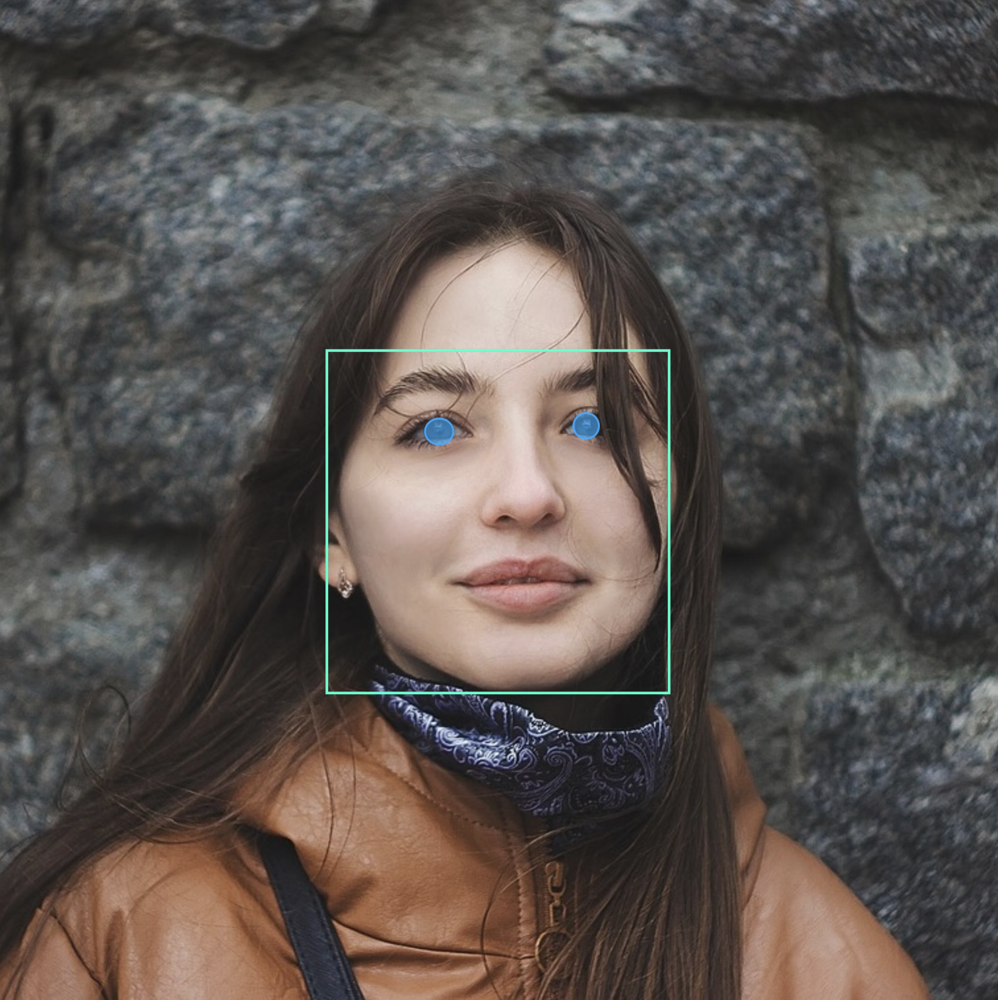

# face_detection_tflite

[](https://pub.dev/packages/face_detection_tflite/score)
[](https://pub.dev/packages/face_detection_tflite)

Flutter implementation of Google's MediaPipe face and facial landmark detection models using TensorFlow Lite.
Completely local: no remote API, just pure on-device, offline detection.

### Bounding Boxes


### Facial Mesh (468-Point)


### Facial Landmarks


### Eye Tracking

#### Iris Detection:



#### Eye Area Mesh (71-Point):

Note: The Facial mesh and eye area mesh are separate. 


#### Eye Contour:


## Features

- On-device face detection, runs fully offline
- 468 point mesh with **3D depth information** (x, y, z coordinates)
- Face landmarks, comprehensive eye tracking (iris + 71-point eye mesh), and bounding boxes
- All coordinates are in absolute pixel coordinates
- Truly cross-platform: compatible with Android, iOS, macOS, Windows, and Linux
- The [example](https://pub.dev/packages/face_detection_tflite/example) app illustrates how to detect and render results on images
  - Includes demo for bounding boxes, the 468-point mesh, facial landmarks and comprehensive eye tracking.

## Quick Start

```dart
import 'dart:io';
import 'package:face_detection_tflite/face_detection_tflite.dart';

Future main() async {
  FaceDetector detector = FaceDetector();
  await detector.initialize(model: FaceDetectionModel.backCamera);

  final imageBytes = await File('path/to/image.jpg').readAsBytes();
  List<Face> faces = await detector.detectFaces(imageBytes);

  for (final face in faces) {
    final boundingBox = face.boundingBox;
    final landmarks   = face.landmarks;
    final mesh = face.mesh;
    final eyes = face.eyes;
  }

  detector.dispose();
}
```

## Bounding Boxes

The boundingBox property returns a BoundingBox object representing the face bounding box in
absolute pixel coordinates. The BoundingBox provides convenient access to corner points,
dimensions (width and height), and the center point.

### Accessing Corners

```dart

final BoundingBox boundingBox = face.boundingBox;

// Access individual corners by name (each is a Point with x and y)
final Point topLeft     = boundingBox.topLeft;       // Top-left corner
final Point topRight    = boundingBox.topRight;      // Top-right corner
final Point bottomRight = boundingBox.bottomRight;   // Bottom-right corner
final Point bottomLeft  = boundingBox.bottomLeft;    // Bottom-left corner

// Access coordinates
print('Top-left: (${topLeft.x}, ${topLeft.y})');
```

### Additional Bounding Box Parameters

```dart

final BoundingBox boundingBox = face.boundingBox;

// Access dimensions and center
final double width  = boundingBox.width;     // Width in pixels
final double height = boundingBox.height;    // Height in pixels
final Point center = boundingBox.center;  // Center point

// Access coordinates
print('Size: ${width} x ${height}');
print('Center: (${center.x}, ${center.y})');

// Access all corners as a list (order: top-left, top-right, bottom-right, bottom-left)
final List<Point> allCorners = boundingBox.corners;
```

## Landmarks

The landmarks property returns a FaceLandmarks object with 6 key facial feature points
in absolute pixel coordinates. These landmarks provide quick access to common facial
features with convenient named properties.

### Accessing Landmarks

```dart
final FaceLandmarks landmarks = face.landmarks;

// Access individual landmarks using named properties
final leftEye  = landmarks.leftEye;
final rightEye = landmarks.rightEye;
final noseTip  = landmarks.noseTip;
final mouth    = landmarks.mouth;
final leftEyeTragion  = landmarks.leftEyeTragion;
final rightEyeTragion = landmarks.rightEyeTragion;

// Access coordinates
print('Left eye: (${leftEye?.x}, ${leftEye?.y})');
print('Nose tip: (${noseTip?.x}, ${noseTip?.y})');

// Iterate through all landmarks
for (final point in landmarks.values) {
  print('Landmark: (${point.x}, ${point.y})');
}
```

## Face Mesh

The `mesh` property returns a `FaceMesh` object containing 468 facial landmark points with both
2D and 3D coordinate access. These points map to specific facial features and can be used for
precise face tracking and rendering.

### Accessing Mesh Points

  ```dart
  import 'package:face_detection_tflite/face_detection_tflite.dart';

  final FaceMesh? mesh = face.mesh;

  if (mesh != null) {
    // Get mesh points
    final points = mesh.points;

    // Total number of points (always 468)
    print('Mesh points: ${points.length}');

    // Iterate through all points (all mesh points have z-coordinates)
    for (int i = 0; i < points.length; i++) {
      final point = points[i];
      print('Point $i: (${point.x}, ${point.y}, ${point.z})');
    }

    // Access individual points using index operator
    final noseTip = mesh[1];     // Nose tip point
    final leftEye = mesh[33];    // Left eye point
    final rightEye = mesh[263];  // Right eye point
  }
  ```

### Accessing Points with Optional Depth Information

The `FaceMesh` points have x and y coordinates, and an optional z coordinate representing
depth. 3D coordinates are always computed for mesh and iris landmarks.

  ```dart
  import 'package:face_detection_tflite/face_detection_tflite.dart';

  final FaceMesh? mesh = face.mesh;

  if (mesh != null) {
    // Get all points
    final points = mesh.points;

    // Iterate through all points
    for (final point in points) {
      if (point.is3D) {
        print('Point with depth: (${point.x}, ${point.y}, ${point.z})');
      } else {
        print('Point: (${point.x}, ${point.y})');
      }
    }

    // Access individual points directly using index operator
    final noseTip = mesh[1];
    if (noseTip.is3D) {
      print('Nose tip depth: ${noseTip.z}');
    }
  }
  ```

## Eye Tracking (Iris + Eye Mesh)

The `eyes` property returns comprehensive eye tracking data for both eyes in absolute pixel
coordinates. Each eye includes:
- **Iris center** (`irisCenter`): The iris center point
- **Iris contour** (`irisContour`): 4 points outlining the iris boundary
- **Contour** (`contour`): 15 points outlining the eyelid
- **Mesh** (`mesh`): 71 landmarks covering the entire eye region

Only available in FaceDetectionMode.full.

### Accessing Eye Data

```dart

final EyePair? eyes = face.eyes;

// Access left and right eye data (each is an Eye object containing all eye info)
final Eye? leftEye = eyes?.leftEye;
final Eye? rightEye = eyes?.rightEye;

if (leftEye != null) {
  // Access iris center
  final irisCenter = leftEye.irisCenter;
  print('Left iris center: (${irisCenter.x}, ${irisCenter.y})');

  // Access iris contour points (4 points outlining the iris)
  for (final point in leftEye.irisContour) {
    print('Iris contour: (${point.x}, ${point.y})');
  }

  // Access eye mesh landmarks (71 points covering the entire eye region)
  for (final point in leftEye.mesh) {
    print('Eye mesh point: (${point.x}, ${point.y})');
  }

  // Access just the eyelid contour (first 15 points of the eye mesh)
  for (final point in leftEye.contour) {
    print('Eyelid contour: (${point.x}, ${point.y})');
  }
}

// Right eye works the same way
if (rightEye != null) {
  final irisCenter = rightEye.irisCenter;
  print('Right iris center: (${irisCenter.x}, ${irisCenter.y})');
}
```

### Rendering Eye Contours

For rendering the visible eyelid outline, use the `contour` getter and connect them using `eyeLandmarkConnections`:

```dart
import 'package:face_detection_tflite/face_detection_tflite.dart';

// Get the visible eyeball contour (first 15 of 71 points)
final List<Point> eyelidOutline = leftEye.contour;

// Draw the eyelid outline by connecting the points
for (final connection in eyeLandmarkConnections) {
  final p1 = eyelidOutline[connection[0]];
  final p2 = eyelidOutline[connection[1]];
  canvas.drawLine(
    Offset(p1.x, p1.y),
    Offset(p2.x, p2.y),
    paint,
  );
}
```

## Face Detection Modes

This app supports three detection modes that determine which facial features are detected:

| Mode | Features | Est. Time per Face* |
|------|----------|---------------------|
| **Full** (default) | Bounding boxes, landmarks, 468-point mesh, eye tracking (iris + 71-point eye mesh) | ~80-120ms           |
| **Standard** | Bounding boxes, landmarks, 468-point mesh | ~60ms               |
| **Fast** | Bounding boxes, landmarks | ~30ms               |

*Est. times per faces are based on 640x480 resolution on modern hardware. Performance scales with image size and number of faces.

### Code Examples

The Face Detection Mode can be set using the `mode` parameter when detectFaces is called. Defaults to FaceDetectionMode.full.

```dart
// Full mode (default): bounding boxes, 6 basic landmarks + mesh + comprehensive eye tracking
// note: full mode provides superior accuracy for left and right eye landmarks
// compared to fast/standard modes. use full mode when precise eye tracking
// (iris center, iris contour, eyelid shape) is required. trade-off: longer inference
await faceDetector.detectFaces(bytes, mode: FaceDetectionMode.full);

// Standard mode: bounding boxes, 6 basic landmarks + mesh. inference time
// is faster than full mode, but slower than fast mode.
await faceDetector.detectFaces(bytes, mode: FaceDetectionMode.standard);

// Fast mode: bounding boxes + 6 basic landmarks only. fastest inference
// time of the three modes.
await faceDetector.detectFaces(bytes, mode: FaceDetectionMode.fast);
```

Try the [sample code](https://pub.dev/packages/face_detection_tflite/example) from the pub.dev example tab to easily compare
modes and inferences timing.

## Models

This package supports multiple detection models optimized for different use cases:

| Model | Best For | 
|-------|----------|
| **backCamera** (default) | Group shots, distant faces, rear camera | 
| **frontCamera** | Selfies, close-up portraits, front camera | 
| **shortRange** | Close-range faces (within ~2m) |
| **full** | Mid-range faces (within ~5m) |
| **fullSparse** | Mid-range faces with faster inference (~30% speedup) | 

### Code Examples

The model can be set using the `model` parameter when initialize is called. Defaults to FaceDetectionModel.backCamera.

```dart
FaceDetector faceDetector = FaceDetector();

// backCamera (default): larger model for group shots or images with smaller faces
await faceDetector.initialize(model: FaceDetectionModel.backCamera);

// frontCamera: optimized for selfies and close-up portraits
await faceDetector.initialize(model: FaceDetectionModel.frontCamera);

// shortRange: best for short-range images (faces within ~2m)
await faceDetector.initialize(model: FaceDetectionModel.shortRange);

// full: best for mid-range images (faces within ~5m)
await faceDetector.initialize(model: FaceDetectionModel.full);

// fullSparse: same detection quality as full but runs up to 30% faster on CPU
// (slightly higher precision, slightly lower recall)
await faceDetector.initialize(model: FaceDetectionModel.fullSparse);
```

## Live Camera Detection


For real-time face detection with a camera feed, use the `camera` package with `FaceDetectionMode.fast`:

```dart
FaceDetector detector = FaceDetector();
await detector.initialize(model: FaceDetectionModel.frontCamera);

final cameras = await availableCameras();
CameraController camera = CameraController(cameras.first, ResolutionPreset.medium);
await camera.initialize();

camera.startImageStream((image) async {
  // Convert CameraImage to bytes
  final bytes = convertToBytes(image);

  // Detect faces in fast mode for real-time performance
  List<Face> faces = await detector.detectFaces(bytes, mode: FaceDetectionMode.fast);
});
```

See the full [example app](https://pub.dev/packages/face_detection_tflite/example) for complete implementation including frame throttling.

## Example

The [sample code](https://pub.dev/packages/face_detection_tflite/example) from the pub.dev example tab includes a
Flutter app that paints detections onto an image: bounding boxes, landmarks, mesh, and comprehensive eye tracking. The
example code provides inference time, and demonstrates when to use `FaceDetectionMode.standard` or `FaceDetectionMode.fast`.

## Inspiration

At the time of development, there was no open-source solution for cross-platform, on-device face and landmark detection.
This package took inspiration and was ported from the original Python project **[patlevin/face-detection-tflite](https://github.com/patlevin/face-detection-tflite)**. Many thanks to the original author.
